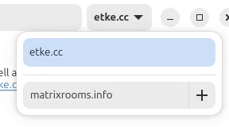

<!--
SPDX-FileCopyrightText: 2023 - 2025 Nikita Chernyi
SPDX-FileCopyrightText: 2024 Benoit Marty
SPDX-FileCopyrightText: 2024 Slavi Pantaleev
SPDX-FileCopyrightText: 2025 Suguru Hirahara

SPDX-License-Identifier: AGPL-3.0-or-later
-->

# Integrations

Matrix Rooms Search (short: MRS) provides various integrations both via [Matrix protocol](https://spec.matrix.org/) APIs,
and via own [REST API](../openapi.yml) for applications.

<!-- vim-markdown-toc GFM -->

* [Matrix integrations](#matrix-integrations)
    * [Directory Server](#directory-server)
        * [Cinny](#cinny)
        * [FluffyChat](#fluffychat)
        * [Fractal](#fractal)
        * [Element Web and Desktop](#element-web-and-desktop)
        * [Element Classic Android and SchildiChat Android](#element-classic-android-and-schildichat-android)
    * [Notary Key Server](#notary-key-server)
        * [Synapse](#synapse)
        * [Conduit, Tuwunel, Continuwuity, Conduwuit, Grapevine, etc](#conduit-tuwunel-continuwuity-conduwuit-grapevine-etc)
        * [Dendrite, Harmony, etc](#dendrite-harmony-etc)
    * [MSCs](#mscs)
        * [MSC1929](#msc1929)
        * [MSC3266](#msc3266)
* [Applications](#applications)
    * [SearXNG](#searxng)

<!-- vim-markdown-toc -->

## Matrix integrations

This section describes [Matrix protocol](https://spec.matrix.org/) integrations provided by MRS.

### Directory Server

MRS implements the mandatory subset of Matrix Federation API to provide the Public Rooms Directory over federation, so you can use it on your matrix client apps directly.

#### Cinny

**Just for you**:

1. Click on the **Explore Community** button on the left sidebar
2. Click on the **Add Server** button
3. Enter `matrixrooms.info` to the "Server Name" input area
4. Click the **View** button

**For all app users** (for all users of the Cinny app instance):

Add the following to Cinny's `config.json`:

```json
{
    "featuredCommunities": {
        "servers": ["matrixrooms.info"]
    }
}
```

If you use [etke.cc/ansible](https://github.com/etkecc/ansible) or [matrix-docker-ansible-deploy](https://github.com/spantaleev/matrix-docker-ansible-deploy), add the following to your `vars.yml` configuration file:

```yaml
matrix_client_cinny_config_featuredCommunities_servers: ['matrixrooms.info']
```

#### FluffyChat

1. Click on the search bar on the top of the screen and enter anything
2. In the search field a pencil icon and your homeserver domain will appear
3. Click on the pencil icon and enter `https://matrixrooms.info` in the input field

#### Fractal

[Fractal](https://gitlab.gnome.org/World/fractal/) is a Matrix application written in Rust, optimized for GNOME desktop environment.

1. Click on the **Explore** on the left sidebar
2. Click the dropdown menu next to the search bar
3. Enter `matrixrooms.info` to the input area and click the plus button



#### Element Web and Desktop

💡 *This also applies to forks such as [SchildiChat Web / Desktop](https://schildi.chat/).*

**Just for you** (just for your account)

1. Click on `Search` (Ctrl+K) at the top-left corner
2. Scroll down the modal window
3. Click on `Public rooms`
4. Under the search input, click on server selection (`Show: <your server name>`) and click on the `Add new server...`
5. On the opened modal window, enter the server name set to the config.yml (`matrix.server_name` value). In case of the demo instance, it is `matrixrooms.info`
6. Click on `Add`

**For all app users** (for all users of the Element Web/Desktop app instance)

Add the following to Element's `config.json`:

**Clean config** - if you don't have anything else in your `config.json`:

```json
{
    "room_directory": {
        "servers": ["matrixrooms.info"]
    }
}
```

**Existing config** - if you already have a `config.json`, just add the following section inside the main object:

```json
"room_directory": {
    "servers": ["matrixrooms.info"]
}
```

If you use [etke.cc/ansible](https://github.com/etkecc/ansible) or [matrix-docker-ansible-deploy](https://github.com/spantaleev/matrix-docker-ansible-deploy), add the following to your `vars.yml` configuration file:

```yaml
matrix_client_element_room_directory_servers: ['matrixrooms.info']
```

#### Element Classic Android and SchildiChat Android

1. From the room list, click on the floating action button at the bottom right (left for RTL) of the screen
2. Select "Explore Rooms"
3. Tap on the 3-dot menu (top right corner)
4. Tap on the `Change network` in the dropdown menu
5. Tap on the `Add a new server` at the bottom of the screen
6. Enter `matrixrooms.info` to the server name input area and click `OK`
7. Select the newly added server in the list

### Notary Key Server

MRS implements the [Matrix Notary Key Server endpoints](https://spec.matrix.org/v1.16/server-server-api/#querying-keys-through-another-server), allowing homeservers to use it as a notary key server.

#### Synapse

To configure Synapse to use MRS as a notary key server, add the following to your `homeserver.yaml` configuration file:

```yaml
# NOTE: you should have multiple notary key servers for redundancy, usually matrix.org is listed by default
trusted_key_servers:
  - server_name: matrixrooms.info
```

If you use [etke.cc/ansible](https://github.com/etkecc/ansible) or [matrix-docker-ansible-deploy](https://github.com/spantaleev/matrix-docker-ansible-deploy), add the following to your `vars.yml` configuration file:

```yaml
# NOTE: you should have multiple notary key servers for redundancy, usually matrix.org is listed by default
matrix_synapse_trusted_key_servers:
  - server_name: matrixrooms.info
```

#### Conduit, Tuwunel, Continuwuity, Conduwuit, Grapevine, etc

To configure Conduit and its forks to use MRS as a notary key server, add the following to your `config.toml` configuration file:

```toml
# NOTE: you should have multiple notary key servers for redundancy, usually matrix.org is listed by default
trusted_servers = ["matrixrooms.info"]
```

If you use [etke.cc/ansible](https://github.com/etkecc/ansible) or [matrix-docker-ansible-deploy](https://github.com/spantaleev/matrix-docker-ansible-deploy), add the following to your `vars.yml` configuration file:

```yaml
# NOTE: you should have multiple notary key servers for redundancy, usually matrix.org is listed by default
## Conduit
matrix_conduit_trusted_servers: ['matrixrooms.info']
## Conduwuit
matrix_conduwuit_trusted_servers: ['matrixrooms.info']
## Continuwuity
matrix_continuwuity_config_trusted_servers: ['matrixrooms.info']
## Other forks are not yet supported in the playbooks at the moment of writing
```

#### Dendrite, Harmony, etc

To configure Dendrite and its forks to use MRS as a notary key server, add the following to your `dendrite.yaml` configuration file,
inside the `federation_api` section:

```yaml
# NOTE: you should have multiple notary key servers for redundancy, usually matrix.org is listed by default
key_perspectives:
  - server_name: matrixrooms.info
```

If you use [etke.cc/ansible](https://github.com/etkecc/ansible) or [matrix-docker-ansible-deploy](https://github.com/spantaleev/matrix-docker-ansible-deploy), add the following to your `vars.yml` configuration file:

```yaml
# NOTE: you should have multiple notary key servers for redundancy, usually matrix.org is listed by default
## Dendrite
matrix_dendrite_configuration_extension_yaml: |
  federation_api:
    key_perspectives:
      - server_name: matrixrooms.info
## Other forks are not yet supported in the playbooks at the moment of writing
```

### MSCs

MSC stands for Matrix Spec Change — a proposed changes to the matrix protocol, but not yet included within it. Below is the MSCs relevant to MRS.

#### MSC1929

MRS integrates [MSC1929](https://github.com/matrix-org/matrix-spec-proposals/pull/1929) natively, in order to help homeserver administrators to combat unlawful actions. See details on [this page](./msc1929.md).

#### MSC3266

MRS integrates [MSC3266](https://github.com/matrix-org/matrix-spec-proposals/pull/3266) for room preview API. The API is available both via stable and unstable endpoints. See the API's spec file for details.

## Applications

### SearXNG

SearXNG is a free internet metasearch engine which aggregates results from more than 70 search services, preventing them from tracking or profiling users. Some SearXNG instances can also be accessed over Tor for online anonymity.

See [the official SearXNG documentation](https://docs.searxng.org/dev/engines/online/mrs.html) for details.
